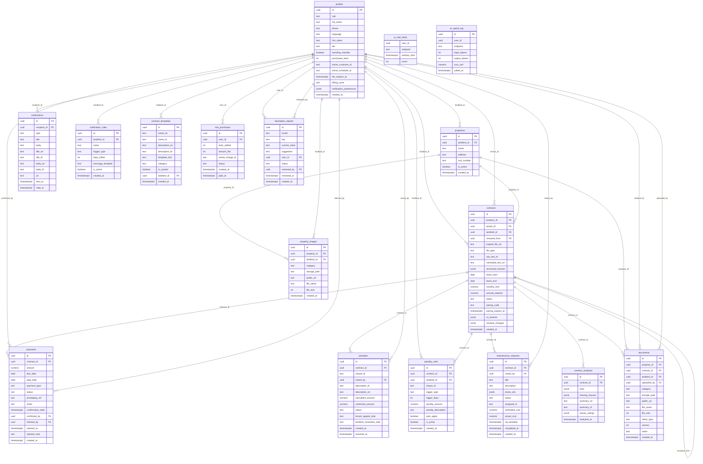

# RentOS Data Model Audit

**Date:** 2026-04-11  
**Scope:** 37 SQL migrations + API layer code  
**Auditor:** Senior Backend / Data Architecture agent

---

## Executive Summary

Five critical or high-severity issues require resolution before production launch:

1. **Contract state machine is partially enforced** — The DB constraint lists the correct states but no trigger or check constraint enforces transition rules (e.g., `active` requires parsed clauses + arrived `lease_start`). Only `activateContract()` in app code guards these invariants; direct DB writes bypass them entirely.
2. **`combined_pro_features.sql` is a phantom migration with no timestamp** — It duplicates tables that were already created by timestamped migrations (`penalty_rules`, `notification_rules`, `contract_analyses`, `contract_templates`). If it runs after the timestamped files, it silently no-ops via `IF NOT EXISTS`; if it runs first it creates the tables without their RLS policies later overriding correctly. Its position in the migration sequence is undefined.
3. **`ai_rate_limits` and `ai_spend_log` have no write policies for service role — but also no FK to `profiles`** — `user_id` is a plain UUID with no FK constraint, meaning orphaned rate-limit and spend rows are possible after an account deletion.
4. **Payment status can diverge from claim state** — A payment that has been claimed (`claimed_at IS NOT NULL`) can still sit at `status='pending'` indefinitely; there is no timeout or escalation. The `overdue` status is set by cron/API but there is no constraint preventing `status='paid'` while `claimed_by IS NULL` (landlord can mark paid without a claim).
5. **Tenant-uploaded document allows `landlord_id` spoofing** — In `20260411000002_tenant_document_upload.sql`, the tenant INSERT policy enforces `uploaded_by = auth.uid()` but does NOT constrain `landlord_id`. The comment says "landlord_id is set by the server from the contract row" but nothing in the DB prevents a tenant from supplying a forged `landlord_id` value in the INSERT payload if the API route fails to set it.

---

## Full Schema Diagram



> **Side tables (not charted):** `ai_rate_limits`, `ai_spend_log` — no FK to `profiles`, service-role write only.

---

## Findings

### Schema Integrity

---

**FINDING SI-1**

- **Severity:** High
- **Migration:** `combined_pro_features.sql` (no timestamp prefix)
- **Description:** This file is a concatenated dump of `20260408100001_penalty_rules.sql` + `20260408100002_notification_rules.sql` + `20260408100003_contract_analyses.sql` + `20260408100004_contract_templates.sql` + `20260408100005_seed_templates.sql` with no `IF NOT EXISTS` guards on the RLS policy names. If Supabase's migration runner applies files alphabetically before timestamped ones, `combined_pro_features.sql` runs before the `20260408*` files — creating the tables fine, but the policies in both files will conflict (`landord_all` defined twice on `penalty_rules`). If it runs after, the `CREATE TABLE IF NOT EXISTS` silently skips but the RLS `CREATE POLICY` statements will **error out** because the policies already exist. The file has no `DROP POLICY IF EXISTS` guards.
- **Impact:** Unpredictable migration state depending on Supabase runner ordering. In production environments where migrations are applied by filename order, this file could break an otherwise clean apply.
- **Fix:** Delete `combined_pro_features.sql` from the migrations folder entirely. It was clearly a development scratch file — all its content is duplicated by the timestamped files. Add a `-- DO NOT APPLY` header and `.gitignore` entry at minimum until deleted.

---

**FINDING SI-2**

- **Severity:** Medium
- **Migration:** `20260409_ai_rate_limits.sql` (lines 1–31)
- **Description:** `ai_rate_limits.user_id` and `ai_spend_log.user_id` are plain `UUID NOT NULL` columns with no `REFERENCES profiles(id)` FK constraint. No `ON DELETE CASCADE` exists.
- **Impact:** After account deletion via `/api/account/delete`, rate-limit and spend rows for that user become orphaned. The tables also accept inserts for user IDs that don't exist in `profiles`, which could bypass per-user spend caps if service-role code doesn't validate first.
- **Fix:** Add `REFERENCES auth.users(id) ON DELETE CASCADE` (not `profiles(id)`, since the service role acts before a profile exists in edge cases) on both `user_id` columns.

---

**FINDING SI-3**

- **Severity:** Low
- **Migration:** `20260406000001_initial_schema.sql` (line 34)
- **Description:** `profiles.language` initial CHECK allows only `('th', 'en')`. Migration `20260410000002_language_zh_and_reports.sql` drops and recreates the check to add `'zh'`, which is correct. However the initial schema comment `-- Thai co-primary` in memory conflicts: new accounts default to `'th'` but there is no validation that the `language` column aligns with the `notification_preferences` JSONB keys (which are English keys like `payment_due`). These are in different "namespaces" but could confuse future contributors.
- **Impact:** No functional issue today; maintenance risk only.
- **Fix:** Add a code comment linking `language` (UI locale) to the notification_preferences JSONB schema. No SQL change required.

---

**FINDING SI-4**

- **Severity:** Low
- **Migration:** `20260406000001_initial_schema.sql` (multiple tables)
- **Description:** No `updated_at` column or trigger exists on any table. The following mutable tables have no change-tracking timestamp: `profiles`, `properties`, `contracts`, `penalties`, `payments`, `maintenance_requests`, `notifications`, `penalty_rules`, `notification_rules`, `documents`, `property_images`.
- **Impact:** Cannot do incremental sync, cache invalidation by timestamp, or auditing "what changed when" without reading every row. Analytics queries (e.g., "updated today") are impossible. Supabase realtime subscriptions work without `updated_at` but audit trail gaps will affect compliance.
- **Fix:** Add `updated_at TIMESTAMPTZ DEFAULT NOW()` to all mutable tables and a `BEFORE UPDATE` trigger calling `NEW.updated_at = NOW()`.

---

**FINDING SI-5**

- **Severity:** Low
- **Migration:** `20260409_founding_member_flag.sql` (line 3)
- **Description:** `UPDATE profiles SET founding_member = true WHERE created_at < NOW()` marks every existing profile as a founding member since `created_at < NOW()` is always true at migration time. Migration `20260409_p0sec_founding_member_fix.sql` partially corrects this by resetting dev seed emails, but any real dev/test accounts using non-`@rentos.dev` / non-`@example.com` email domains are still incorrectly marked.
- **Impact:** Dev/staging users get founding-member pricing benefits. Low severity because `REVOKE UPDATE` on the `founding_member` column prevents users from self-exploiting this.
- **Fix:** The backfill logic in `_founding_member_flag.sql` should have been `WHERE created_at < '2026-04-09'` (a fixed cutoff date), not `< NOW()`. Document clearly in the `_fix.sql` migration that this remains a best-effort cleanup for non-seed dev accounts.

---

### Contract Lifecycle

---

**FINDING CL-1**

- **Severity:** Critical
- **Migration:** `20260409120000_contract_state_machine.sql` (lines 1–45)
- **Description:** The PM memory specifies: "no `active` without parsed clauses + arrived `lease_start`; no `pending` without successful parse; `parse_failed` and `scheduled` are new states." The migration adds the correct states to the CHECK constraint and performs a one-time data cleanup (lines 14–41), but **installs zero trigger or check constraint to enforce these invariants on future writes**. The unique partial index `contracts_one_active_per_property` (line 44) enforces only the one-active-per-property rule at the DB level. All other invariants are enforced exclusively in `lib/contracts/activate.ts` at the application layer.
- **Impact:** Any direct Supabase dashboard edit, service-role API call, or future API route that bypasses `activateContract()` can set `status='active'` with no clauses or a future `lease_start`. This has already happened in production (the migration's own data-cleanup at lines 14–16 corrects rows that had `status='active'` with no clauses, proving the app code path was bypassed historically).
- **Fix:** Add a DB-level trigger:
  ```sql
  CREATE OR REPLACE FUNCTION enforce_contract_state_invariants()
  RETURNS TRIGGER LANGUAGE plpgsql AS $$
  BEGIN
    IF NEW.status = 'active' THEN
      IF NEW.structured_clauses IS NULL OR jsonb_array_length(NEW.structured_clauses) = 0 THEN
        RAISE EXCEPTION 'Cannot set contract active: structured_clauses is empty';
      END IF;
      IF NEW.lease_start IS NULL OR NEW.lease_start > CURRENT_DATE THEN
        RAISE EXCEPTION 'Cannot set contract active: lease_start has not arrived';
      END IF;
      IF NEW.tenant_id IS NULL THEN
        RAISE EXCEPTION 'Cannot set contract active: no tenant';
      END IF;
    END IF;
    IF NEW.status = 'pending' THEN
      -- pending is pre-parse; no clause requirement
      NULL;
    END IF;
    RETURN NEW;
  END;
  $$;
  CREATE TRIGGER contracts_state_invariants
    BEFORE INSERT OR UPDATE OF status ON contracts
    FOR EACH ROW EXECUTE FUNCTION enforce_contract_state_invariants();
  ```

---

**FINDING CL-2**

- **Severity:** High
- **Migration:** `20260409100001_contract_pending_status.sql` (line 10), `20260409100005_awaiting_signature.sql` (lines 1–4), `20260409120000_contract_state_machine.sql` (lines 1–7)
- **Description:** The contract `status` CHECK constraint evolved through three migrations:
  - `20260409100001`: `('pending', 'active', 'expired', 'terminated')`
  - `20260409100005`: `('pending', 'active', 'awaiting_signature', 'expired', 'terminated')`
  - `20260409120000`: `('pending', 'active', 'awaiting_signature', 'scheduled', 'parse_failed', 'expired', 'terminated')`

  **`renewal` status is absent from every migration.** The PM memory says the expected lifecycle includes `renewal` as a state (`draft → pending → scheduled → active → renewal → expired`). `renewal` was never added to the CHECK constraint.

  Additionally, `draft` status was in the original PM-spec but is absent from all constraints. The app uses `pending` as the pre-parse state.

- **Impact:** If any code path attempts to set `status='renewal'` or `status='draft'`, the CHECK constraint will reject it at the DB level with an opaque error. Contracts in a conceptual "renewal" stage use the `awaiting_signature` state per code inspection.
- **Fix:** Either add `'renewal'` to the CHECK constraint or formally document in code/migrations that `awaiting_signature` serves the renewal-signing step and `renewal` is not a DB-level state. Remove `draft` from PM state-machine documentation if it was never implemented.

---

**FINDING CL-3**

- **Severity:** Medium
- **Migration:** `20260409120000_contract_state_machine.sql` (lines 29–41)
- **Description:** The deduplication logic keeps the **newest** active contract per property (by `created_at DESC`) and terminates older ones. This is pragmatic but destroys data: a property with two legitimate contracts (e.g., a renewal that was accidentally activated before the original expired) silently terminates the older one with no audit record of why.
- **Impact:** Landlords may lose visibility into terminated contracts' payment history. Tenants whose contracts were silently terminated may be confused.
- **Fix:** Log the termination reason to a `termination_reason TEXT` column or an audit table before the `UPDATE`. Alternatively, fire a notification to the landlord for each auto-terminated row.

---

**FINDING CL-4**

- **Severity:** Medium
- **Migrations:** `20260409100005_awaiting_signature.sql`, `20260409100002_contract_renewal.sql`, app code `contracts/[id]/activate/route.ts`
- **Description:** The path from `awaiting_signature` → `active` is guarded in `contracts/[id]/activate/route.ts`, which calls `activateContract()`. However `activateContract()` accepts contracts with `status !== 'active'` and sets them active regardless of their current status (line 73: `if (contract.status !== 'active')`). A contract in `parse_failed`, `scheduled`, or even `expired` status could be transitioned to `active` via a direct call to `activateContract()` if the caller has service-role access.
- **Impact:** Expired or failed contracts can be incorrectly reactivated by service-role code paths (cron, backfill route) without passing through the expected state sequence.
- **Fix:** Add a whitelist of allowed source statuses to `activateContract()`: only `['pending', 'scheduled', 'awaiting_signature']` should be valid sources for activation.

---

### Payment Model

---

**FINDING PM-1**

- **Severity:** High
- **Migration:** `20260406000001_initial_schema.sql` (lines 93–105), `20260408000002_payment_confirmation.sql`, `20260409100006_payment_claimed.sql`
- **Description:** The payments table models "observation" correctly (tenant claims → landlord confirms), matching the "No Rent Collection" design intent. However, the `status` CHECK constraint only allows `('pending', 'paid', 'overdue')`. There is no `claimed` status. A payment that has `claimed_at IS NOT NULL` still shows `status='pending'` to both parties, making it indistinguishable from an unclaimed payment in queries that filter only on `status`.
- **Impact:** The landlord's payment list cannot easily distinguish "waiting for tenant to pay" from "tenant claims paid, awaiting confirmation." Queries like `WHERE status = 'pending'` return both states. This forces the UI to do two-column filtering (`status='pending' AND claimed_at IS NOT NULL`), a footgun for future developers.
- **Fix:** Add `'claimed'` to the payments status CHECK constraint. When `claimed_at` is set (via `/api/payments/[id]/claim`), also transition `status` to `'claimed'`. Update `/api/payments/[id]/confirm` to allow confirming from `'claimed'` status (not just `'pending'` and `'overdue'`).

---

**FINDING PM-2**

- **Severity:** Medium
- **Migration:** `20260406000001_initial_schema.sql` (lines 93–105)
- **Description:** `payments.payment_type` CHECK allows `('rent', 'utility', 'deposit', 'penalty')`. There is no `expected_payments` table — the "expected vs. actual" distinction is collapsed into a single `payments` table where all rows are both expected (when `status='pending'`) and actual (when `status='paid'`). The backfill route (`/api/contracts/backfill-payments`) seeds 12 monthly `payment_type='rent'` rows at activation time as the "expected" ledger.
- **Impact:** This is an acceptable simplification for the MVP but means there is no separate `expected_payments` concept distinct from `payments`. Partial payments (e.g., tenant pays half the rent) are not representable — there is no `amount_paid` vs `amount_expected` split. If a tenant pays a different amount than the seeded row, the landlord must edit the row amount, losing the original expected value.
- **Fix:** Add `amount_expected NUMERIC(12,2)` and retain `amount` as `amount_paid`. Alternatively, add a `partial_payment` boolean and `amount_paid` column. Document in a migration comment that this is a known simplification.

---

**FINDING PM-3**

- **Severity:** Medium
- **Migration:** `lib/contracts/activate.ts` (lines 117–135)
- **Description:** The idempotency check for backfill-payments uses `WHERE payment_type = 'rent' LIMIT 1`. If a contract has utility or deposit payments seeded manually, the check still works correctly. However, if the same contract is activated twice in rapid succession (race condition between two concurrent requests), the check at line 117 could pass for both before either insert completes, resulting in 24 rent rows instead of 12.
- **Impact:** Duplicate payment rows — tenant and landlord see double the expected payments.
- **Fix:** Add a unique partial index: `CREATE UNIQUE INDEX payments_one_pending_rent_per_due_date ON payments(contract_id, due_date) WHERE payment_type='rent' AND status='pending'`. This makes the race condition fail cleanly on the second insert rather than silently doubling.

---

**FINDING PM-4**

- **Severity:** Low
- **Migration:** `20260408000002_payment_confirmation.sql` (line 3)
- **Description:** `payments.confirmed_by` references `profiles(id)`. The `confirm` API endpoint (`app/api/payments/[id]/confirm/route.ts:87`) sends a `payment_due` notification type on confirmation instead of a dedicated `payment_confirmed` type. The notification type `payment_due` semantically means "you have a payment due" not "your payment was confirmed."
- **Impact:** Tenants receive a misleading notification type. The notification body is correct ("Payment Confirmed") but any code that routes on `type='payment_due'` will also catch confirmation notifications, leading to potential duplicate processing.
- **Fix:** Add `'payment_confirmed'` to the `notifications_type_check` constraint and update the confirm route to use it.

---

### Pairing

---

**FINDING PA-1**

- **Severity:** High
- **Migration:** `20260408000001_pairing_notifications_cotenants.sql` (lines 5–9), `app/api/pairing/redeem/route.ts` (lines 43–46)
- **Description:** The pairing code redemption queries `WHERE pairing_code = ? AND status IN ('pending', 'active')`. An `active` contract can still have a pairing code if the code was generated but the tenant already paired (because the code is cleared only on successful pair in the same route). More critically: there is **no DB-level uniqueness constraint on `pairing_code`**. If by extreme coincidence two contracts have the same 6-character code simultaneously, a tenant could pair with the wrong contract.
- **Impact:** 6-character alphanumeric from `Array.from(crypto.getRandomValues(new Uint8Array(4)))` yields a ~1.7 billion space (36^6), making collision unlikely but not impossible. The partial index `idx_contracts_pairing_code` helps lookup performance but does not enforce uniqueness.
- **Fix:** Add `CREATE UNIQUE INDEX contracts_pairing_code_unique ON contracts(pairing_code) WHERE pairing_code IS NOT NULL`. The application code should handle the unique violation and retry with a new code.

---

**FINDING PA-2**

- **Severity:** High
- **Migration:** `app/api/pairing/redeem/route.ts` (lines 62–96)
- **Description:** The pairing redeem path has a **TOCTOU (time-of-check/time-of-use) race condition**. The sequence is:
  1. Check `contract.tenant_id IS NULL` (or equals caller)
  2. Update `tenant_id = user.id` (separate write)

  Two concurrent requests with the same code from two different tenants can both pass the check at step 1 before either write completes. The second write wins at the DB level (no unique constraint on `tenant_id` per contract). The first tenant's pairing silently gets overwritten.

- **Impact:** Two tenants believe they are paired to the same contract; only the last writer is actually linked. The first tenant has no contract and no error message.
- **Fix:** Use an atomic `UPDATE ... WHERE pairing_code = ? AND tenant_id IS NULL RETURNING id` in a single statement. If 0 rows are returned, the code was already claimed. Alternatively use a `SELECT ... FOR UPDATE` lock before the update.

---

**FINDING PA-3**

- **Severity:** Medium
- **Migration:** `20260408000001_pairing_notifications_cotenants.sql` (line 9)
- **Description:** `co_tenants` is stored as `JSONB DEFAULT '[]'` — an array of `{full_name, phone}` objects. These are not linked to `profiles(id)` rows. Co-tenants have no Supabase auth accounts, no ability to read their own contract, and no way to use the app. The pairing system (`app/api/pairing/co-tenant/route.ts`) manages this field but co-tenants are purely metadata with no RLS-enforced identity.
- **Impact:** Co-tenants are display-only. This is presumably intentional for MVP but the data model implies they could receive notifications or access the app, which they cannot. The discoverability gap could confuse future developers.
- **Fix:** Add a migration comment documenting that `co_tenants` is display-only metadata (not app users). If co-tenant app access is ever needed, a separate `contract_tenants` join table referencing `profiles(id)` will be required.

---

**FINDING PA-4**

- **Severity:** Low
- **Migration:** `20260408000001_pairing_notifications_cotenants.sql` (lines 5–6)
- **Description:** When a pairing code expires, the `pairing_code` and `pairing_expires_at` columns on the contract are NOT automatically cleared. They persist until a new code is generated (which overwrites them) or a tenant successfully pairs (which nulls them). A contract can have a stale expired code sitting in the column indefinitely with no TTL-based cleanup.
- **Impact:** Stale codes cannot be redeemed (the app checks expiry), but they consume the unique code slot and make the column state misleading.
- **Fix:** Add a cron step (or DB trigger on `pairing_expires_at < NOW()`) to null out expired codes periodically. The existing daily cron route (`app/api/cron/daily/route.ts`) is the natural home for this.

---

### Audit Trails

---

**FINDING AT-1**

- **Severity:** High
- **Migration:** `20260406000001_initial_schema.sql` and all subsequent migrations
- **Description:** **No table has an `updated_at` column or trigger.** The only timestamp on most tables is `created_at`. The following state-changing tables have zero mutation tracking:
  - `contracts` — status transitions leave no timestamp trace
  - `penalties` — only `resolved_at` exists; `confirmed_at` is absent
  - `payments` — `paid_date DATE` (not timestamptz), `confirmation_date TIMESTAMPTZ` added later; no `updated_at`
  - `maintenance_requests` — `completed_at` added in `20260408100007` but no general `updated_at`
  - `profiles` — tier changes, role changes, founding_member flag changes leave no trace
- **Impact:** Cannot answer: "When did this contract transition from pending to active?", "When was this penalty confirmed?", "When did this user's tier change?" Critical for dispute resolution and PDPA audit requirements in Thailand.
- **Fix:** See SI-4 recommendation. Add `updated_at` + trigger to all mutable tables in a single migration.

---

**FINDING AT-2**

- **Severity:** Medium
- **Migration:** `20260406000001_initial_schema.sql` (lines 71–90)
- **Description:** `penalties.resolved_at` is nullable but there is no constraint ensuring it is set when `status IN ('resolved', 'waived')`. A penalty can be moved to `resolved` status with `resolved_at = NULL`.
- **Impact:** Reporting queries that filter `WHERE resolved_at IS NOT NULL` will miss some resolved penalties. Time-to-resolution metrics will be incorrect.
- **Fix:** Add a trigger or CHECK constraint: `CHECK (status NOT IN ('resolved','waived') OR resolved_at IS NOT NULL)`.

---

**FINDING AT-3**

- **Severity:** Medium
- **Migration:** `20260406000001_initial_schema.sql`, no soft-delete pattern found in any migration
- **Description:** No table uses soft deletes (`deleted_at`). The only "deletion" patterns are:
  - `ON DELETE CASCADE` on child tables (penalty_rules, contract_analyses, etc.)
  - Hard `DELETE` for account deletion (`/api/account/delete/route.ts`)
  - No `deleted_at` column on properties, contracts, payments, or notifications.
- **Impact:** Deleted properties cascade-delete contracts → payments → penalties, permanently destroying financial history. For a property management app serving landlords who may need payment history for tax purposes, permanent cascade deletion is a compliance risk.
- **Fix:** Add `deleted_at TIMESTAMPTZ` to `properties`, `contracts`, and `payments`. Change `ON DELETE CASCADE` to `ON DELETE SET NULL` or `ON DELETE RESTRICT` where financial history must be preserved. The account-delete route should soft-delete data for the landlord's retention period (Thai commercial records typically 5 years).

---

**FINDING AT-4**

- **Severity:** Low
- **Migration:** `20260408100006_document_vault.sql` (line 6)
- **Description:** `documents.version INTEGER NOT NULL DEFAULT 1` suggests version tracking but no mechanism exists to create new versions. The API routes for documents only do INSERT (new document) or DELETE — there is no versioning logic that bumps `version` or links previous versions.
- **Impact:** `version` is essentially always 1 and is misleading. Future developers may assume versioning is implemented when it is not.
- **Fix:** Either implement proper versioning (add `previous_version_id UUID REFERENCES documents(id)`) or drop the `version` column and document in a migration comment that versioning is not yet implemented.

---

### State Machine Soundness

---

**FINDING SM-1**

- **Severity:** Critical\*\*
- **Migration:** `20260406000001_initial_schema.sql` (lines 80–89), `app/api/penalties/[id]/route.ts` (not read, but inferred from `appeal` route)
- **Description:** The penalty state machine has a **reviewer gap**. States: `pending_landlord_review → confirmed → pending_tenant_appeal → appeal_under_review → resolved / waived`. Once a penalty moves to `appeal_under_review`, there is **no reviewer assignment, no timeout, and no mechanism to move it forward**. The RLS policy allows landlords full access to penalties via `penalties_landlord_all`, so the landlord could theoretically update the status, but:
  1. There is no DB constraint blocking a landlord from moving `appeal_under_review` → `pending_landlord_review` (going backwards).
  2. There is no `reviewer_id` or timestamp for when the appeal was received.
  3. Terminal states `resolved` and `waived` have no guard against being reverted: a landlord can UPDATE any penalty's status (their `FOR ALL` policy has no status-based `USING` clause).
- **Impact:** Penalties can cycle indefinitely. A resolved penalty can be un-resolved. A waived penalty can be reopened. No audit trail of state transitions.
- **Fix:**
  1. Add a `reviewer_id UUID REFERENCES profiles(id)` and `appeal_received_at TIMESTAMPTZ` column.
  2. Add a trigger that prevents backward transitions and prevents updates to `resolved`/`waived` penalties except by service_role.
  3. Add `resolved_at` population enforcement (see AT-2).

---

**FINDING SM-2**

- **Severity:** High
- **Migration:** `20260408100007_maintenance_enhancements.sql` (lines 1–7), `app/api/maintenance/[id]/route.ts`
- **Description:** The maintenance state machine (`open → in_progress → resolved`) is enforced in app code via `validTransitions` (line 46 of the route) but **not at the DB level**. The valid transitions dict only maps `open → in_progress` and `in_progress → resolved`. A direct DB write or future API route bypass can set any status arbitrarily.

  Additionally, `completed_at` is auto-set when `status='resolved'` in the PATCH route (line 131), but there is no DB constraint ensuring `completed_at IS NOT NULL` when `status='resolved'`. A direct DB `UPDATE maintenance_requests SET status='resolved'` without setting `completed_at` creates an inconsistent row.

  `sla_deadline` has no enforcement: a request can be `in_progress` past its SLA with no automatic status change or alert.

- **Impact:** Maintenance requests can enter invalid states; `completed_at` can be NULL for resolved requests, breaking time-to-resolution analytics.
- **Fix:**
  1. Add DB trigger enforcing `open → in_progress → resolved` only (no skips, no reversals).
  2. Add CHECK: `CHECK (status != 'resolved' OR completed_at IS NOT NULL)`.
  3. Add SLA breach detection to the daily cron.

---

**FINDING SM-3**

- **Severity:** Medium
- **Migration:** `20260410000001_slot_unlocks.sql` (lines 5–14)
- **Description:** `slot_purchases.status` allows `('pending', 'paid', 'failed', 'refunded')`. There is no guard preventing a `failed` purchase from being updated to `paid` after the fact (no terminal-state enforcement). The `slot_purchases` INSERT policy (`slot_purchases_insert_own`) allows tenants to insert their own slot purchases, but there is no UPDATE policy defined. This means authenticated users **cannot** update their own slot purchase rows — which is intentional (Omise callback updates via service role), but the INSERT-without-UPDATE pattern means a tenant could insert a `pending` row with a fake `omise_charge_id` and rely on the Omise webhook to confirm it. The webhook validation is in app code, not enforced at DB level.
- **Impact:** Slot purchase fraud requires bypassing the Omise webhook, which is app-layer validated. Low actual risk but the DB layer provides no defense-in-depth.
- **Fix:** Add a CHECK constraint preventing transitions FROM terminal states: `CHECK (status IN ('pending','paid','failed','refunded'))` already exists; add a trigger blocking `failed → paid` and `refunded → paid` transitions.

---

**FINDING SM-4**

- **Severity:** Low
- **Migration:** `20260410000002_language_zh_and_reports.sql` (lines 6–27)
- **Description:** `translation_reports.status` allows `('pending', 'accepted', 'rejected', 'applied')`. The flow implies `pending → accepted → applied` or `pending → rejected`, but no transition enforcement exists. A report could jump from `pending` to `applied` skipping review. `reviewed_by` and `reviewed_at` are only set by app code — a direct DB write to `status='applied'` would leave them NULL.
- **Impact:** Admin workflow integrity only; no tenant/landlord user impact.
- **Fix:** Add trigger enforcing that `reviewed_by` and `reviewed_at` are set before transitioning to `accepted`, `rejected`, or `applied`.

---

## Additional Observations (Not Findings)

- **`property_images.public_url NOT NULL`**: Inconsistent with `documents.public_url` which was made nullable (via `20260409_p0sec_documents_public_url_nullable.sql`). The `property-images` bucket is intentionally public (per migration comment), so this is intentional — worth a comment noting the divergence.
- **`documents.tenant_select` RLS policy**: Only matches documents where `c.status = 'active'` (line 26 of `20260408100006_document_vault.sql`). After a contract expires, tenants lose access to their own uploaded documents. This may be intentional but should be documented.
- **`notifications` missing INSERT policy**: RLS is enabled but there is no INSERT policy for the `notifications` table (only SELECT and UPDATE). All inserts go via service role (`lib/notifications/send.ts`), which is intentional and documented — but worth a comment in the migration.
- **`translation_reports` missing SELECT policy for authenticated users**: Only INSERT is allowed for authenticated users; SELECT/UPDATE are service-role only (as noted in the migration comment). This is intentional but means users cannot see the status of their own translation reports.

---

## Data Model Readiness Verdict

The RentOS schema is functional for MVP but has three blockers that must be fixed before a production launch with real tenants: (1) The contract state machine has zero DB-level enforcement of its core invariant — "no active without clauses + arrived lease_start" — meaning a single service-role mistake or admin dashboard edit can corrupt the contract lifecycle for a real tenant; (2) the pairing race condition (FINDING PA-2) allows two tenants to fight over the same contract code with the second writer silently winning, which is a data integrity failure in the most critical onboarding flow; and (3) the absence of `updated_at` timestamps across all mutable tables means there is no audit trail for dispute resolution, which is a compliance gap under Thai PDPA. The payment observation model (claim → confirm) is architecturally sound and matches the "no rent collection" intent. The penalty and maintenance state machines work in the happy path but are vulnerable to state corruption via direct DB access. The `combined_pro_features.sql` phantom file is a deployment timebomb that must be removed immediately. With the three blockers resolved and the `combined_pro_features.sql` file deleted, the schema is defensible for a guarded beta launch with <100 landlords.
